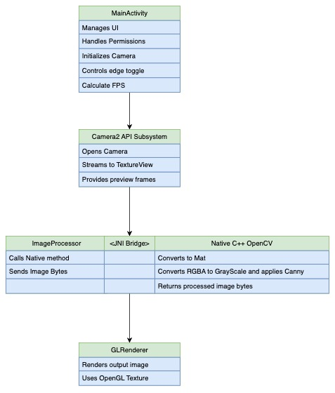

# Real-Time Edge Detection Viewer
Minimal Android app that captures camera frames, processes
them using OpenCV in C++ (via JNI), and displays the processed output using  OpenGL ES.

## Features Implemented
### 1 Camera Feed Integration
Implemented the Camera frames capture using `Camera2 API` and `SurfaceTexture`view.

### 2 Frame Processing via OpenCV (C++)
- Each frame is sent to native C++ code using JNI interface.
- C++ code applies Grayscale filter to convert `RBGA` image to Gray and then applies the `Canny Edge Detection`
- Convert back the Gray image to `RGBA` and return the image for rendering.

### 3 Render Output with OpenGL ES
- Render the processed image using OpenGL ES 2.0 (as a texture).
- Smooth frame rate is maintained.

### 4 Toggle between Raw Feed and Edge detected output
Implemented the toggle button option to switch between raw feed and processed image feed.

### 5 Added FPS counter
Added a frame processing `TextView` to display the FPS both with raw feed and processed feed.

# Demo video
Please view the demo video [here](demo_video.mp4).

## Setup Instruction

### References Used for Development:
> Used `Android Studio` for this project development.
> Followed the Android developer guide https://developer.android.com/ndk/guides for developing this project. This gave me a boilerplate NDK project.
> Followed the OpenCV on Android guide https://docs.opencv.org/4.x/d5/df8/tutorial_dev_with_OCV_on_Android.html

### Project Structure
I am following the default project structure provide by Android Studio Native C boilerplate project.
- The entire codebase is inside `app/` directory.
- `Java` codebase is inside `app/src/main/java`. This includes codes for `MainActivity`, `JNI` interface `ImageTransformer` and `GLRenderer` to render the output using `OpenGL ES2.0`.
- `C++` code for edge detection and `OpenCV` dependencies are part of `src/main/cpp`.

### Steps
- Go to your `Android Studio` and Open this project `File -> New -> Project from Version Control...`
- Provide the link to this repo and add the project. Let the project build.
- Make sure you have `NDK` and `CMake` is installed in your Android Studio
  > Go `Tools -> SDK Manager -> SDK Tools` and checkbox the `NDK` and `CMake` tools and Apply.
- `OpenCV` dependencies are statically added in this project. And `CMakeLists.txt` already links my `native-lib.cpp` code with `OpenCV` dependencies.

## Architecture overview
Below is the high level architecture:

